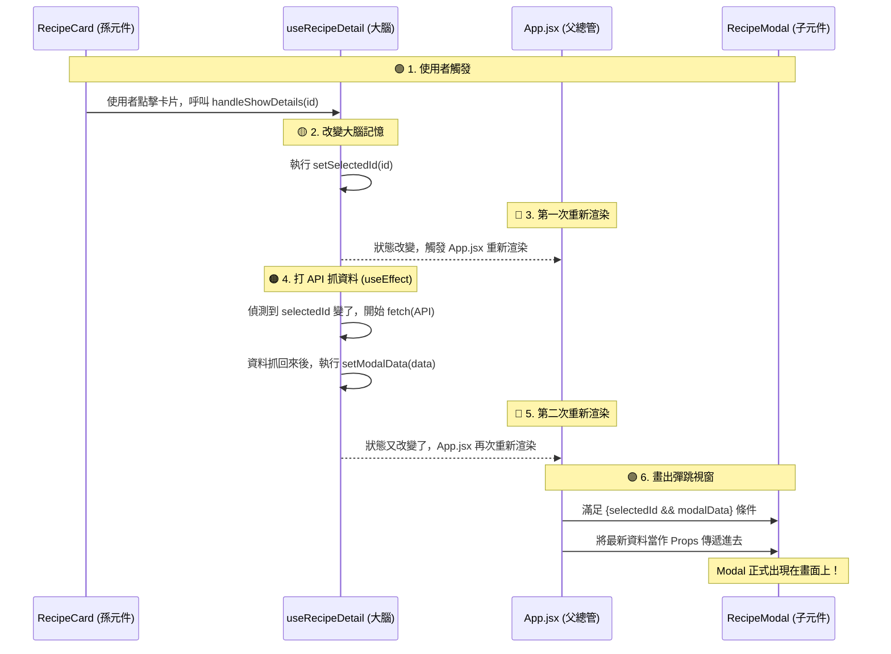
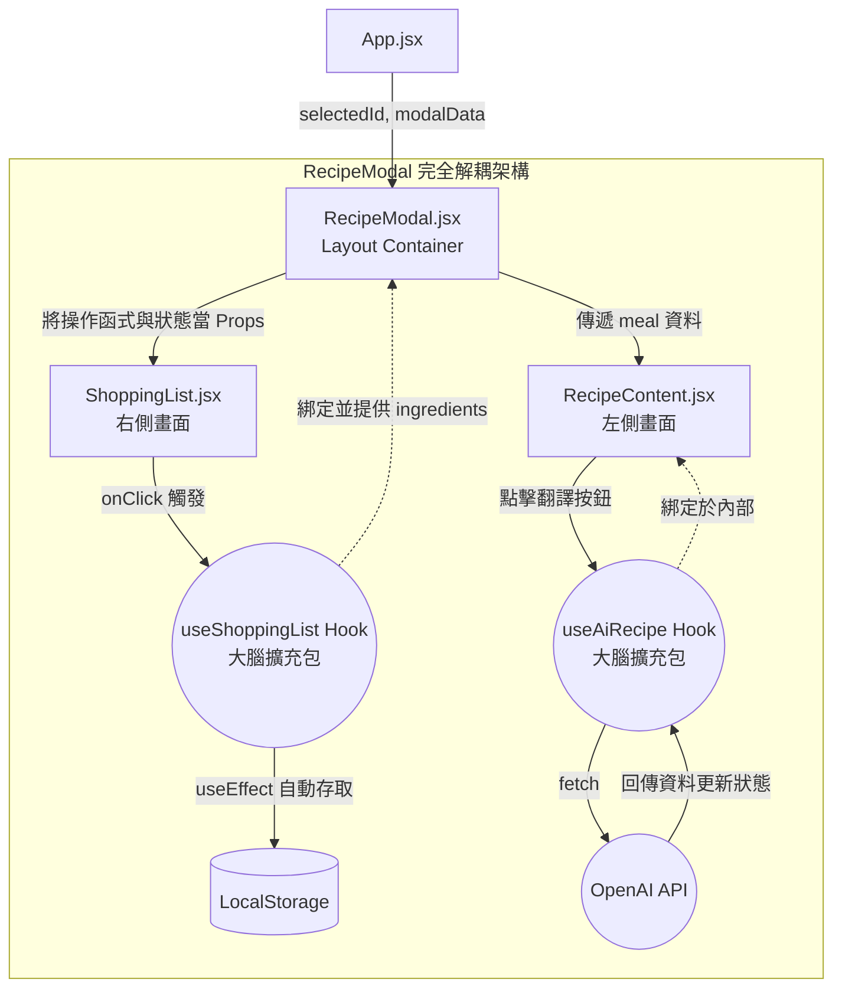

# React 重構與核心觀念筆記 (Senior's Note)

這份筆記專門記錄我們在重構過程中，所糾正的核心觀念與技術重點。這將作為你面試與實戰時的知識寶庫。隨著重構推進，這份筆記會持續更新。

---

## 1. 單向資料流與 Props 的精確傳遞 (One-Way Data Flow)
**發生情境**：第一階段重構 `TechStackModal` 時。

**❌ 常見的新手誤區**：
以為「父層透過 useState 設置，將 isOpen、setInfoOpen 等透過傳遞布林值給子元件」。這把**變數**與**函式**混為一談了。

**✅ 資深工程師的精確理解**：
- **傳遞資料 (Data)**：`isOpen` 是一個布林值 (Boolean)。父元件傳遞這個資料，子元件根據它來決定「現在要長什麼樣子 (UI 狀態)」。
- **傳遞動作 (Callback Function)**：`onClose` (也就是觸發 `setIsInfoOpen` 的動作) 是一個**函式 (Function)**。父元件傳遞這個函式，就像是給了子元件一個「遙控器」。

**運作原理 (The "Why")**：
React 嚴格遵守「單向資料流」，資料永遠只能**由上往下 (從父元件到子元件)** 傳遞。
1. **父元件 (`App.jsx`)**：擁有真正的狀態 (State)，以及改變狀態的權力。
2. **子元件 (`TechStackModal`)**：本身**沒有權力**改變父層的狀態。它只能被動接收資料。當使用者點擊「關閉按鈕」時，子元件實際上是「呼叫 (Call)」了父元件傳進來的那個函式。狀態的改變，依舊是在父元件身上發生的。

> **💡 前輩的白話文**：
> 「狀態是變數，改變狀態的行為是函式。子元件不能憑空生出 Props 傳給別人，Props 永遠是由外而內、由上往下的。子元件若要影響父元件的狀態，唯一合法的方法就是『按遙控器』—— 也就是執行父元件傳下來的函式。」

## 2. 按下遙控器後發生的事 (React Re-render Cycle)
針對「子元件按下遙控器後，到底發生了什麼？」這個問題，這是 React 運作的完整生命週期：

1. **子元件觸發 (Trigger)**：使用者在 `TechStackModal` 點擊關閉按鈕，子元件執行了 `onClose()`。
2. **父層函式執行 (Execute in Parent)**：因為 `onClose` 是 `App.jsx` 傳進來的，所以實際上執行的是 `App.jsx` 裡的 `setIsInfoOpen(false)`。這發生在父層的執行環境中。
3. **父層狀態改變 (State Change)**：`App.jsx` 的狀態 `isInfoOpen` 從 `true` 變成了 `false`。
4. **重新渲染 (Re-render)**：React 發現 `App.jsx` 的狀態改變了，於是**命令 `App.jsx` 重新執行一次 (Re-render)**。
5. **資料重新流動 (Data Flow Down)**：在重新執行時，`App.jsx` 會拿著最新的狀態 (`isInfoOpen = false`)，重新當作 Props 傳遞給 `TechStackModal`。
6. **子元件更新 (UI Update)**：`TechStackModal` 收到新的指令 `isOpen={false}`，於是從畫面上消失。
因為是透過副
這就是 React 單向資料流最完美的閉環！

「子元件觸發 -> 父層函式執行 -> React 虛擬 DOM 偵測改變 -> 命令 App.jsx 重新渲染 -> 傳遞新狀態給子元件」

---

## 3. 狀態集中管理 vs Props Drilling (屬性向下鑽取)
**發生情境**：第三階段抽離 `HeroSearch` 時，我們被迫一口氣傳了 9 個 Props 進入子元件。

**✅ 狀態集中管理的好處 (Single Source of Truth)**：
將 State 統一放在父層 (`App.jsx`) 當總管，好處是維持「唯一的資料來源」。你永遠不用擔心 `NavBar` 顯示素食模式開啟，但 `HeroSearch` 卻以為是關閉的。資料流動非常單純，除錯時只要看總管的狀態對不對就好。

**⚠️ 潛在的壞處 (Props Drilling)**：
如果今天 `HeroSearch` 裡面還有「孫元件」，為了把父層的 State 傳給孫元件，中間所有的元件都必須充當「快遞員」，接收並傳遞自己根本用不到的 Props。這種現象會造成程式碼臃腫，且讓元件之間產生「不必要的重度耦合」。

**💡 前輩的解法 (Next Steps)**：
面對 Props Drilling，業界的標準解法正如你所推測的：
1. **全域狀態管理 (Global State)**：例如你已經有在使用的 `Zustand`，把跨層級需要的狀態（如 `isVeganMode`）放到 Store。這樣孫元件可以直接去 Store 拿資料，不用再靠父層一層層往下傳。
2. **元件組合 (Component Composition)** 或 **Context API**：都是為了解決層層傳遞的麻煩。

---

## 4. Custom Hook 不是子元件！ (Hooks vs Components)
**發生情境**：分析 `useRecipes.jsx` 中的 `loading` 狀態改變如何影響畫面時。

**❌ 常見的新手誤區**：
以為 `useRecipes.jsx` 是一個「子元件」，並誤以為父層重新渲染後，會把狀態傳給 `useRecipes.jsx` 這個子元件。

**✅ 資深工程師的精確理解**：
- **元件 (Component)**：首字母大寫，回傳的是 UI (HTML/JSX)。例如 `<StatusBoard />`。它們在畫面上有樹狀的實體結構 (DOM)。
- **Custom Hook (自訂 Hook)**：以 `use` 開頭，本質上是純 JavaScript 函式。它回傳的是「資料與函式」，而不是 UI。例如 `useRecipes()`。

**運作原理 (The "Why")**：
Custom Hook **絕對不是**子元件，你可以把它想像成是 `App.jsx` (父元件) 的「大腦擴充包」或「隨身碟」。
當 `App.jsx` 執行 `const { loading } = useRecipes()` 時，`useRecipes` 裡面的 `useState` 其實就是**直接綁定在 `App.jsx` 自己身上**！

因此，當 `useRecipes` 在 `finally` 區塊執行 `setLoading(false)` 時，它**並不是**子元件在按遙控器，而是 **`App.jsx` 的大腦直接修改了自己的記憶**。

**正確的資料流動路徑**：
1. **大腦改變**：非同步請求結束，`useRecipes` (大腦擴充包) 裡的 `setLoading(false)` 被觸發，`App.jsx` 的狀態改變。
2. **重新渲染**：React 發現 `App.jsx` 狀態變了，命令 `App.jsx` 重新渲染 (Re-render)。
3. **向下傳遞**：重新渲染時，`App.jsx` 將新的狀態 `loading={false}` 傳入**真正的子元件** `<StatusBoard />`。
4. **UI 更新**：`<StatusBoard />` 收到新的 Props，發現 `loading` 變成 false，於是 `{loading && 
...
}` 的條件不成立，轉圈圈動畫就從畫面上消失了。

---
「改變父層記憶 -> 觸發重新渲染 -> 向下傳遞新狀態 -> 條件渲染子元件」這個黃金法則。

## 5. 從點擊到彈窗的完整生命週期 (Click to Modal Render)
**發生情境**：將資料獲取邏輯抽離成 `useRecipeDetail` Hook 後，梳理 Modal 顯示的完整流程。

**📝 嚴格的工程師名詞定義**：
- `useRecipeDetail.jsx` 是 **Hook (大腦擴充包)**。
- `handleShowDetails` 是一個 **函式 (Function/方法)**，它是由 Hook 提供出來給別人呼叫的工具。
- `selectedId` 是 **狀態 (State/變數)**，負責記錄目前選擇的食譜 ID。

**✅ 完整的 5 步連鎖反應**：
1. **觸發函式 (Trigger)**：使用者點擊食譜卡片，執行了 `handleShowDetails(id)`。
2. **改變記憶 (State Update)**：該函式內部執行了 `setSelectedId(id)`。因為 Hook 綁在 `App.jsx` 上，所以 `App.jsx` 的狀態改變了。
3. **副作用發動 (useEffect Fetching)**：這步最關鍵！`selectedId` 一改變，Hook 內部的 `useEffect` 偵測到變化，開始打 API 抓詳細資料。資料回來後，執行 `setModalData(data)`，又改變了一次狀態。
4. **重新渲染 (Re-render)**：React 發現 `App.jsx` 的狀態 (`selectedId` 和 `modalData`) 都有東西了，命令 `App.jsx` 重新執行。
5. **條件渲染 (Conditional Rendering)**：`App.jsx` 在重新渲染時，讀到 `{selectedId && modalData && <RecipeModal />}`。因為兩個變數都有值 (True)，React 於是**把 `<RecipeModal>` 這個元件「畫」出來**，並把資料透過 Props 傳進去。

### 視覺化流程圖 (Visual Data Flow)

「事件觸發 -> 狀態改變 -> 重新渲染 -> 副作用 -> 再次改變狀態 -> 條件渲染」的路徑，是 React 最核心、也是最精華的運作邏輯。

---

## 6. 從點擊打勾到 LocalStorage 存檔的連鎖反應
**發生情境**：在 `RecipeModal.jsx` 中點擊食材打勾，資料如何流進 LocalStorage？

**❌ 常見的新手誤區**：
以為切換 Tab (`setActiveTab`) 會觸發存檔，或者以為 `const saved = localStorage.getItem(...)` 是用來存檔的。

**✅ 資深工程師的精確理解**：
- `localStorage.getItem(...)` 只會在**元件剛出生 (Mount)** 的那瞬間執行一次，用來「讀取」舊資料。
- 真正負責「存檔」的，是躲在 Hook 裡面的 `useEffect`。它的依賴陣列寫著 `[ingredients]`，意思是：「只要 `ingredients` 發生任何改變，我就執行存檔」。

**正確的資料流動路徑 (The Flow)**：
1. **點擊觸發**：使用者在 `RecipeModal` 畫面上點擊食材，觸發 `onClick={() => toggleIngredient(item.id)}`。
2. **呼叫遙控器**：執行了 `useShoppingList` (大腦) 裡面的 `toggleIngredient` 函式。
3. **改變記憶**：該函式執行 `setIngredients`，改變了食材的 `isCompleted` 狀態。
4. **重新渲染**：因為大腦記憶變了，`RecipeModal` 重新渲染，畫面上出現了「打勾」的樣式。
5. **副作用發動 (自動存檔)**：大腦裡的 `useEffect` 就像一個守衛，它發現 `ingredients` 變了！於是它馬上自動執行 `localStorage.setItem(...)`，把最新的狀態寫入瀏覽器的資料庫裡。

**這就是 Custom Hook 封裝業務邏輯的威力**：畫面端只要負責「按按鈕」，存檔這種髒活、累活，全部由 Hook 內部的 `useEffect` 自動搞定！

---

## 7. 最終重構架構總攬：RecipeModal 關注點分離
**發生情境**：完成 `RecipeModal.jsx` 巨型元件拆解後，梳理各個模組的職責與資料流向。

**✨ 核心原則：關注點分離 (Separation of Concerns)**
- **容器元件 (Container)**：只負責排版與組裝，不寫死邏輯。
- **展示元件 (Presentational)**：只負責接收資料並畫出 UI，不處理資料庫。
- **自訂 Hook (Custom Hook)**：只處理業務邏輯 (Business Logic)，不碰 UI。

### 🗺️ 現代化 React 架構與資料流向圖

**📊 資料與邏輯流向解析：**
1. **主控中心 (`RecipeModal.jsx`)**：它現在非常乾淨。它掛載了 `useShoppingList` 大腦，拿到了所有的資料與遙控器，並負責把這些東西派發給左右兩邊的畫面。
2. **右側清單 (`ShoppingList.jsx`)**：它完全不知道 LocalStorage 是什麼。它只負責畫出 `<ul>` 跟 `<li>`，當使用者點擊打勾時，按下 `toggleIngredient` 這個遙控器。接下來的存檔動作，全部交給 `useShoppingList` 自動處理。
3. **左側食譜 (`RecipeContent.jsx`)**：我們把 `useAiRecipe` 直接裝進了它裡面。所以它是一個**完全自給自足**的元件，它自己管理 AI 的讀取狀態，自己負責畫出 AI 的 UI。這確保了左邊的 AI 邏輯絕對不會去污染到右邊的購物清單。
